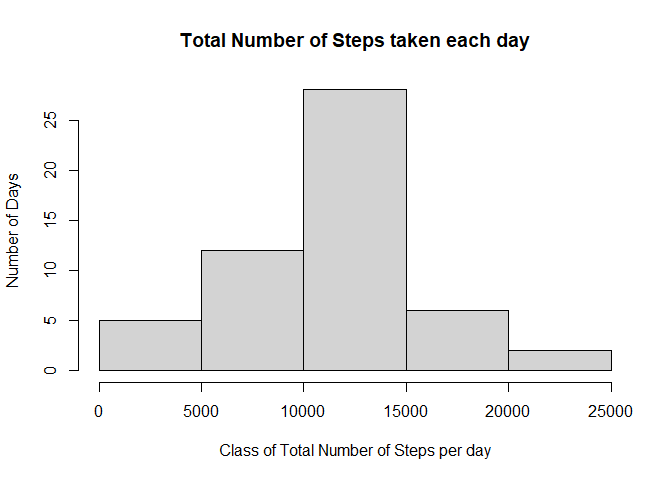
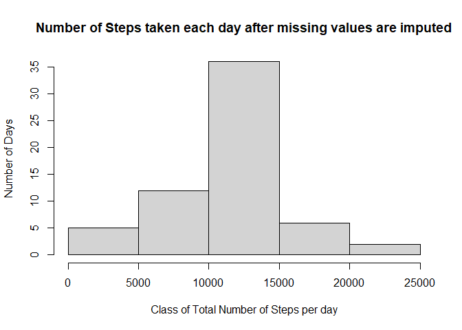
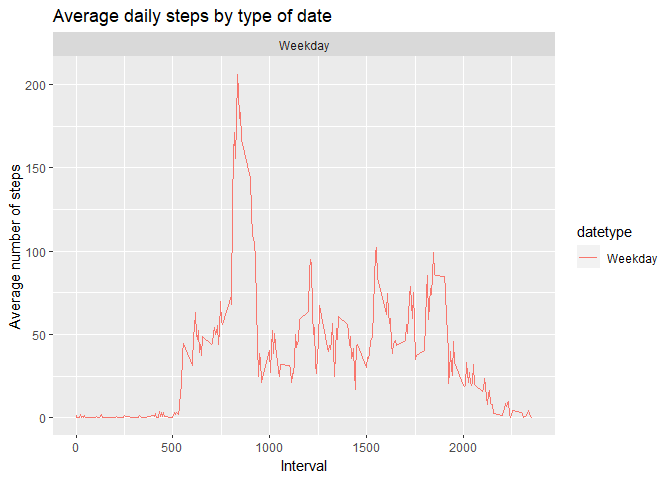

## Assignment

It is now possible to collect a large amount of data about personal movement using activity monitoring devices such as a Fitbit, Nike Fuelband, or Jawbone Up. These type of devices are part of the “quantified self” movement – a group of enthusiasts who take measurements about themselves regularly to improve their health, to find patterns in their behavior, or because they are tech geeks. But these data remain under-utilized both because the raw data are hard to obtain and there is a lack of statistical methods and software for processing and interpreting the data.

This assignment makes use of data from a personal activity monitoring device. This device collects data at 5 minute intervals through out the day. The data consists of two months of data from an anonymous individual collected during the months of October and November, 2012 and include the number of steps taken in 5 minute intervals each day.

The data for this assignment can be downloaded from the course web site:

-Dataset: Activity monitoring data [52K]

The variables included in this dataset are:

-Steps: Number of steps taking in a 5-minute interval (missing values are coded as NA\color{red}{\verb|NA|}NA)
-Date: The date on which the measurement was taken in YYYY-MM-DD format
-Interval: Identifier for the 5-minute interval in which measurement was taken

The dataset is stored in a comma-separated-value (CSV) file and there are a total of 17,568 observations in this dataset.

**1. Loading and preprocessing the data**

Show any code that is needed to

-Load the data (i.e. read.csv())
-Process/transform the data (if necessary) into a format suitable for your analysis


**2. What is mean total number of steps taken per day?**

-Calculate the total number of steps taken per day
-Make a histogram of the total number of steps taken each day
-Calculate and report the mean and median of the total number of steps taken per day

**3. What is the average daily activity pattern?**

-Make a time series plot (i.e. type = "l"\color{red}{\verb|type = "l"|}type = "l") of the 5-minute interval (x-axis) and the average number of steps taken, averaged across all days (y-axis)
 -Which 5-minute interval, on average across all the days in the dataset, contains the maximum number of steps?

**4. Imputing missing values**

Note that there are a number of days/intervals where there are missing values (coded as NA\color{red}{\verb|NA|}NA). The presence of missing days may introduce bias into some calculations or summaries of the data.

-Calculate and report the total number of missing values in the dataset (i.e. the total number of rows with NA\color{red}{\verb|NA|}NAs)
-Devise a strategy for filling in all of the missing values in the dataset. The strategy does not need to be sophisticated. For example, you could use the mean/median for that day, or the mean for that 5-minute interval, etc.
-Create a new dataset that is equal to the original dataset but with the missing data filled in.
-Make a histogram of the total number of steps taken each day and Calculate and report the mean and median total number of steps taken per day. Do these values differ from the estimates from the first part of the assignment? What is the impact of imputing missing data on the estimates of the total daily number of steps?

**5. Are there differences in activity patterns between weekdays and weekends?**

For this part the weekdays()\color{red}{\verb|weekdays()|}weekdays() function may be of some help here. Use the dataset with the filled-in missing values for this part.

-Create a new factor variable in the dataset with two levels – “weekday” and “weekend” indicating whether a given date is a weekday or weekend day.
-Make a panel plot containing a time series plot (i.e. type = "l"\color{red}{\verb|type = "l"|}type = "l") of the 5-minute interval (x-axis) and the average number of steps taken, averaged across all weekday days or weekend days (y-axis). 


## 1. Loading and preprocessing the data

First, Let's open all of the libraries required

```r
library(knitr)
library(lubridate)
```

```
## 
## Attaching package: 'lubridate'
```

```
## The following objects are masked from 'package:base':
## 
##     date, intersect, setdiff, union
```

```r
library(ggplot2)
```


Let's unzip and read the data

```r
unzip("activity.zip")
activity<-read.csv("activity.csv")
```

Let's transform the date column into date format using lubridate

```r
activity$date<-ymd(activity$date)
```

Let's explore the basics of this data

```r
summary(activity)
```

```
##      steps             date               interval     
##  Min.   :  0.00   Min.   :2012-10-01   Min.   :   0.0  
##  1st Qu.:  0.00   1st Qu.:2012-10-16   1st Qu.: 588.8  
##  Median :  0.00   Median :2012-10-31   Median :1177.5  
##  Mean   : 37.38   Mean   :2012-10-31   Mean   :1177.5  
##  3rd Qu.: 12.00   3rd Qu.:2012-11-15   3rd Qu.:1766.2  
##  Max.   :806.00   Max.   :2012-11-30   Max.   :2355.0  
##  NA's   :2304
```


## 2. What is mean total number of steps taken per day?

Let's calculate the total steps per day

```r
totalStepsByDay<-aggregate(steps~date, activity, sum)
```

Let's make a png file that contains the plot1-histogram Total Steps and display it

```r
png("plot1.png")
plot1<-hist(totalStepsByDay$steps, xlab="Class of Total Number of Steps per day", ylab="Number of Days", main="Total Number of Steps taken each day")
dev.off()
```

```
## png 
##   2
```

<!-- -->


Let's take a look to the *Mean number of steps taken each day*

```r
mean(totalStepsByDay$steps)
```

```
## [1] 10766.19
```


Let's take a look to the *Median number of steps taken each day*


```r
median(totalStepsByDay$steps)
```

```
## [1] 10765
```

## 3. What is the average daily activity pattern?

Let's Make a time series plot (i.e. type = “l”) of the 5-minute interval (x-axis) and the average number of steps taken, averaged across all days (y-axis) and put it on a png file

```r
averageStepsbyInterval<-aggregate(steps~interval, activity, mean)
png("plot2.png")
plot2<-with(averageStepsbyInterval, plot(interval, steps, type = "l"))
dev.off()
```

```
## png 
##   2
```
<!-- -->

  Now, let's calculate Which 5-minute interval, on average across all the days in the dataset, contains the maximum number of steps

```r
averageStepsbyInterval[which.max(averageStepsbyInterval[,2]),1]
```

```
## [1] 835
```

## 4. Imputing missing values

Let's Calculate and report *the total number of missing values in the dataset* (i.e. the total number of rows with NAs)

```r
missingIndex<-is.na(activity[,1])
sum(is.na(activity$steps))
```

```
## [1] 2304
```

Let's fill in all of the missing values in the dataset with the mean value of steps

```r
averageStepsbyInterval<-aggregate(steps~interval, activity, mean)
m<-mean(averageStepsbyInterval$steps)
m
```

```
## [1] 37.3826
```

Let's Create a new dataset that is equal to the original dataset but with the missing data filled in.

```r
activity1<-activity
activity1[missingIndex,1]<-m
head(activity1)
```

```
##     steps       date interval
## 1 37.3826 2012-10-01        0
## 2 37.3826 2012-10-01        5
## 3 37.3826 2012-10-01       10
## 4 37.3826 2012-10-01       15
## 5 37.3826 2012-10-01       20
## 6 37.3826 2012-10-01       25
```

Do these values differ from the estimates from the first part of the assignment? Let's see *the histogram "Total number of steps taken each day"*

```r
totalStepsByDay1<-aggregate(steps~date, activity1, sum)
png("plot3.png")
hist(totalStepsByDay1$steps, xlab="Class of Total Number of Steps per day", ylab="Number of Days", main="Number of Steps taken each day after missing values are imputed")
dev.off()
```

```
## png 
##   2
```
<!-- -->

Now, the mean of the total number of steps taken per day:

```r
mean_afterImput<-mean(totalStepsByDay1$steps)
mean_afterImput
```

```
## [1] 10766.19
```
And finally,  the median of the total number of steps taken per day:

```r
median_afterImput<-median(totalStepsByDay1$steps)
median_afterImput
```

```
## [1] 10766.19
```

**The difference between the results are not significant since the missing value only represent 13% of the entire data**

## 5. Are there differences in activity patterns between weekdays and weekends?
Let's Create a new factor variable in the dataset with two levels – “weekday” and “weekend” indicating whether a given date is a weekday or weekend day

```r
activity$date <- as.Date(strptime(activity$date, format="%Y-%m-%d"))
activity$datetype <- sapply(activity$date, function(x) {
        if (weekdays(x) == "Saturday" | weekdays(x) =="Sunday") 
                {y <- "Weekend"} else 
                {y <- "Weekday"}
                y
        })
```

Let's Make a panel plot containing a time series plot (i.e. 𝚝𝚢𝚙𝚎 = “𝚕”) of the 5-minute interval (x-axis) and the average number of steps taken, averaged across all weekday days or weekend days (y-axis). See the README file in the GitHub repository to see an example of what this plot should look like using simulated data.

```r
png("plot4.png")
activity_by_date <- aggregate(steps~interval + datetype, activity, mean, na.rm = TRUE)
ggplot(activity_by_date, aes(x = interval , y = steps, color = datetype)) +
       geom_line() +
       labs(title = "Average daily steps by type of date", x = "Interval", y = "Average number of steps") +
       facet_wrap(~datetype, ncol = 1, nrow=2)
dev.off()
```

```
## png 
##   2
```
<!-- -->
